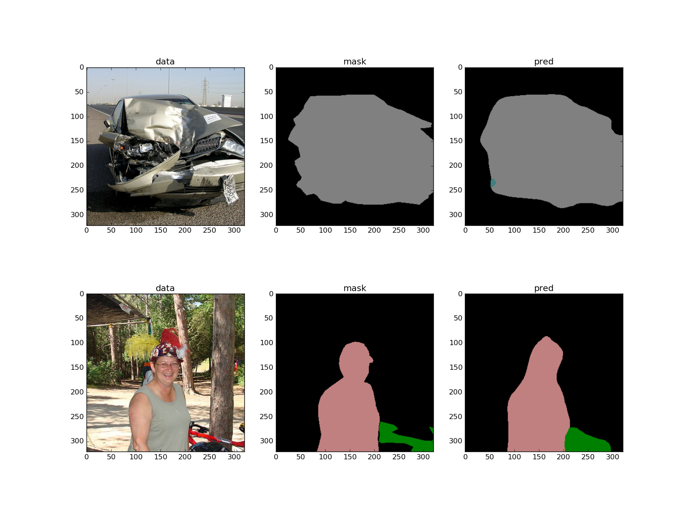
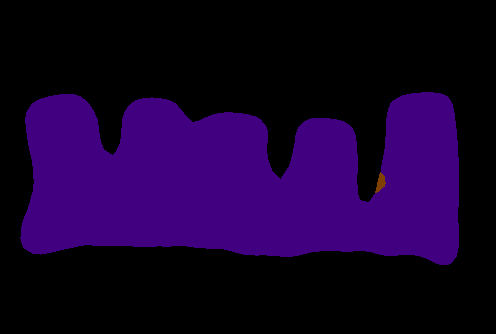

# DeepLab-TensorFlow

This is an implementation of [DeepLab-LargeFOV](http://ccvl.stat.ucla.edu/deeplab-models/deeplab-largefov/) in TensorFlow for semantic image segmentation on [PASCAL VOC dataset](http://host.robots.ox.ac.uk/pascal/VOC/).

## Model Description

The DeepLab-LargeFOV is built on a fully convolutional variant of the [VGG-16 net](http://www.robots.ox.ac.uk/~vgg/research/very_deep/) with several modifications: first, it exploits [atrous (dilated) convolutions](https://github.com/fyu/dilation) to increase the field-of-view; second, the number of filters in the last layers is reduced from <code>4096</code> to <code>1024</code> in order to decrease the memory consumption and the time spent on performing one forward-backward pass; third, it omits the last pooling layers to keep the downsampling ratio of <code>8</code>.

The model is trained on a mini-batch of images and corresponding ground truth masks with the softmax classifier on the top. During training, the masks are downsampled to match the size of the output from the network; during inference, to acquire the output of the same size as the input, bilinear upsampling is applied. The final segmentation mask is acquired using argmax over unnormalised log scores from the network.
Optionally, a fully-connected probabilistic graphical model, namely, CRF, can be applied to refine the final predictions.
On the test set of PASCAL VOC, the model shows <code>70.3%</code> of mean intersection-over-union.

For more details on the underlying model please refer to the following paper:


    @article{CP2016Deeplab,
      title={DeepLab: Semantic Image Segmentation with Deep Convolutional Nets, Atrous Convolution, and Fully Connected CRFs},
      author={Liang-Chieh Chen and George Papandreou and Iasonas Kokkinos and Kevin Murphy and Alan L Yuille},
      journal={arXiv:1606.00915},
      year={2016}
    }


## Requirements

TensorFlow needs to be installed before running the scripts.
TensorFlow>=0.11 is supported.

To install the required python packages (except TensorFlow), run
```bash
pip install -r requirements.txt
```
or for a local installation
```bash
pip install -user -r requirements.txt
```

## Caffe to TensorFlow conversion

To imitate the structure of the model, we have used `.caffemodel` files provided by the [authors](http://ccvl.stat.ucla.edu/deeplab-models/deeplab-largefov/). The `.util/extract_params.py` script saves the structure of the network, i.e. the name of the parameters with their corresponding shapes (in TF 'HNWC' format), as well as the weights of those parameters (again, in the TF format). These weights can be used to initialise the variables in the model; otherwise, the filters will be initialised using the Xavier initialisation scheme, and biases will be initiliased as 0s. 
To use this script you will need to install [Caffe](https://github.com/bvlc/caffe). It is optional, and you can download two already converted models [here](https://drive.google.com/open?id=0B_rootXHuswsTF90M1NWQmFYelU).

## Dataset

To train the network, we use the augmented PASCAL VOC 2012 dataset with <code>10582</code> images for training and <code>1449</code> images for validation. 

## Training

We initialised the network from the `.caffemodel` file provided by the authors. In that model, the last classification layer is randomly initialised using the Xavier scheme with biases set to zeros. The loss function is the pixel-wise softmax loss, and it is optimised using Adam. No weight decay is used. 

The `train.py` script provides an ability to monitor model performance by snapshotting current results:
</img>
Besides that, one can change the input size and augment data with random scaling.

To see the documentation on each of the training settings run the following:
```bash
python train.py --help
```
## Evaluation

After the training, the model shows <code>57%</code> mIoU on the Pascal VOC 2012 validation dataset. The model initialised from the pre-trained `.caffemodel` shows <code>67%</code> mIoU on the same dataset. Note that in the original DeepLab each image is padded so that the input is of size <code>513x513</code> and CRF is used, which can be one of the reason of the lower score (<code>~70.3%</code> mIoU).

To see the documentation on each of the evaluation settings run the following:
```bash
python evaluate.py --help
```

## Inference

To perform inference your own images, use the following command:
```bash
python inference.py /path/to/your/image /path/to/ckpt/file
```
This will run the forward pass and save the resulted mask with this colour map:
</img>
</img>

## Missing features

At the moment, the post-processing step with CRF is not implemented. Besides that, the weight decay is missing, as well.
